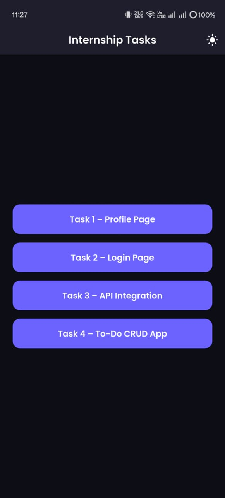
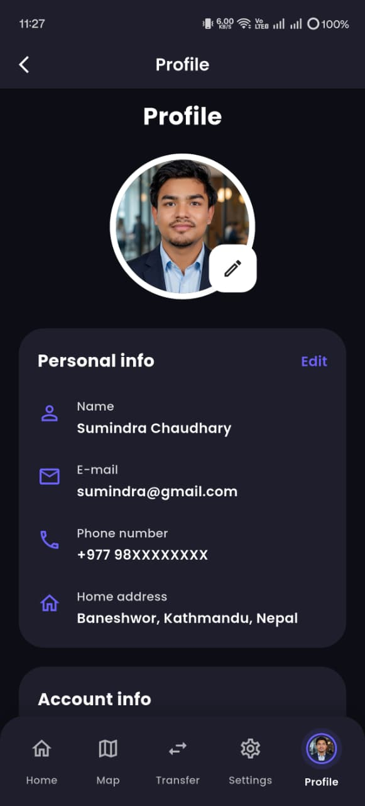
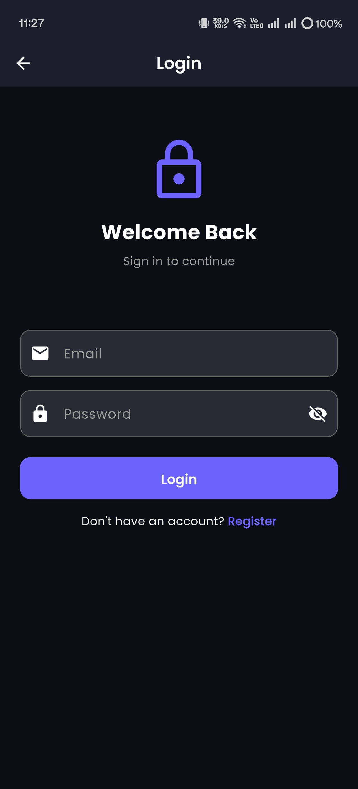
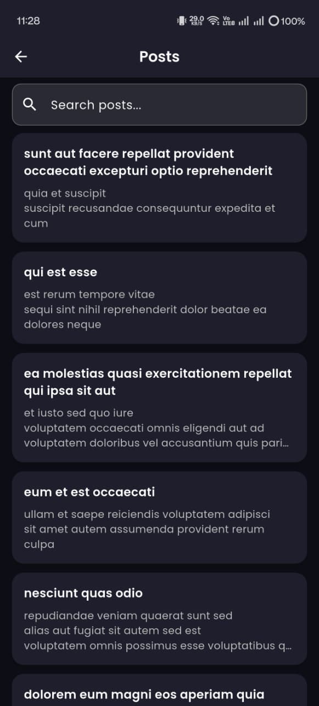
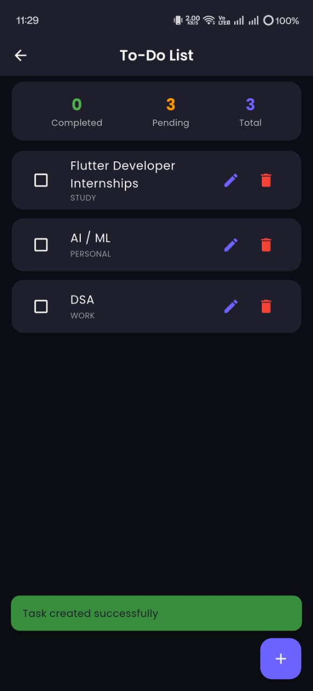

# 🚀 Flutter Internship Assignment

A polished Flutter internship project that showcases real-world Flutter development skills with a modern UI, clean architecture, and reusable component design.

---

## ✨ Overview

This app was built as part of an internship assessment to demonstrate Flutter competency across a complete mobile workflow:
- UI design and responsive layouts
- BLoC state management
- API integration and network handling
- Local persistence with SharedPreferences
- Clean feature-first project organization

---

## 📱 Features

### Task 1 – Profile Page
- Modern profile dashboard with a polished header and user metrics
- Animated entry effects and responsive layout
- Skill chips with progress visualization
- Light and dark theme support

### Task 2 – Login Page
- Validated email and password form
- Password visibility toggle
- Remember Me persistence flow
- Loading indicator and success confirmation

### Task 3 – API Integration
- Fetches posts from **JSONPlaceholder API**
- Shimmer loading placeholders while data loads
- Pull-to-refresh support
- Search and filter functionality
- Error handling with retry UI

### Task 4 – To-Do CRUD App
- Create, edit, and delete tasks
- Complete/uncomplete task actions
- Categorized task view with filtered stats
- Local persistence using `shared_preferences`
- Reusable task cards and modal dialog flows

---

## 🎨 UI / UX Highlights

- Material 3-inspired styling
- Light and dark mode themes
- Custom typography using `google_fonts`
- Smooth transitions and consistent spacing
- Reusable UI components and state-aware widgets

---

## 🛠️ Tech Stack

| Package              | Purpose                      |
|----------------------|------------------------------|
| `flutter_bloc`       | State management             |
| `equatable`          | Value equality for BLoC data |
| `http`               | REST API requests            |
| `shared_preferences` | Local device storage         |
| `shimmer`            | Loading skeleton UI          |
| `google_fonts`       | Custom typography            |
| `uuid`               | Unique identifier generation |

---

## 🏗️ Architecture

This project follows a **feature-first clean architecture** pattern for maintainability and scalability.

- `lib/core/` — theme, routing, constants, and app-wide configuration
- `lib/features/` — isolated feature modules for profile, login, API/posts, and to-do
- `lib/shared/` — reusable widgets, extensions, and helpers
- `lib/models/` — domain models and data structures
- `lib/services/` — API and local storage service implementations

Key principles:
- Separation of concerns
- Reusable components
- Scalable folder organization
- Testable state management with BLoC

---

## 🚀 Getting Started

1. Clone the repository
```bash
git clone https://github.com/cdrysumindra110/flutter_internship_app.git
cd flutter_internship_app
```
2. Install dependencies
```bash
flutter pub get
```
3. Run the app
```bash
flutter run
```
---

## Build APK (Release)

### Generate Release APK

```bash
flutter build apk --release
```

### APK Output Location

After build completes, your APK will be available at:

`build/app/outputs/flutter-apk/app-release.apk`

## APK Download Link
Googel Drive: `https://drive.google.com/file/d/1dG1XPIRc7VeL7GG1wHW_SZS8m-BD_t4Y/view?usp=drive_link`

## 📁 Recommended Folder Structure

```
lib/
├── core/
├── features/
│   ├── task1/
│   ├── task2/
│   ├── task3/
│   └── task4/
├── shared/
├── models/
└── services/
```

---

## �️ Screenshots

| Home | Profile | Login | Posts | To-Do |
|------|---------|-------|-------|-------|
|  |  |  |  |  |


---

## 👨‍💻 Author

**Sumindra Chaudhary**  
Flutter Developer Intern Candidate  
GitHub: `https://github.com/cdrysumindra110/`

---

## ⭐ Support

If you find this project helpful, feel free to give it a star on GitHub.

